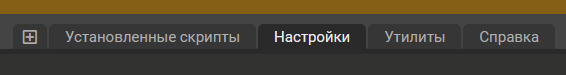

# Pixel Minimap
Данный файл содержит информацию о миникарте для пиксельных площадок

## Содержание
[1. Установка](#installation)  
[2. Функционал](#functional)  
[3. Чек-лист](#checklist)  
[4. Контакты](#contacts)  

## <a id="installation">Установка</a>
1. Установить расширение для вашего браузера [Tampermonkey](https://www.tampermonkey.net)  
(Его можно скачать с официального сайта, а так же найти в каталоге расширений вашего браузера)  
__(Версия Tampermonkey должна быть не ниже 5.0.0)__
2. Открыть [Ссылка 1](https://github.com/KeepssMe/PixelMaps/raw/master/minimap.user.js) или [Ссылка 2](https://raw.githubusercontent.com/KeepssMe/PixelMaps/master/minimap.user.js)
3. Нажать кнопку "Установить" (Install)
4. Откройте сайт пиксельной площадки [PixelPlanet](https://pixelplanet.fun)
5. __Если у вас не оображаются шаблоны - продолжаем__
6. Нажимаем на иконку расширения  

7. Переходим в "Панель управления" (Dashboard)  

8. В окне раcширения переходим на вкладку "Настройки" (Settings)  

9. Меняем "Режим конфигурации" (Config mode) на "Опытный" (Advanced)  

10. Снизу страницы меняем "Режим встраивания" (Inject mode) на "Мгновенно" (Instant)  

__Если после этого у вас по прежнему не видно шаблонов, [свяжитесь с автором](#contacts)__

## <a id="functional">Функционал</a>
В процессе написания...

## <a id="checklist">Чек-лист</a>
В процессе составления...

## <a id="contacts">Контакты</a>
1. [Vk - Алена Воронцова](https://vk.com/alenacrowkar)

Дата обновления: 17.01.2024
