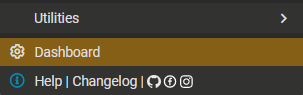
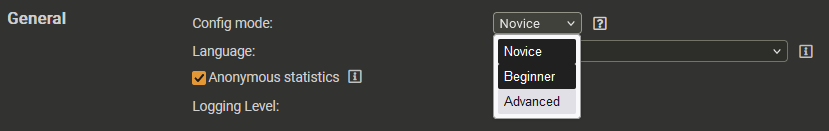
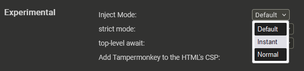

# Pixel Minimap
This file contains information about the minimap for the site [PixelPlanet](https://pixelplanet.fun)  

## Table of content
[1. Installation](#installation)  
[2. Functional](#functional)  
[3. Checklist](#checklist)  
[4. Contacts](#contacts)  

## <a id="installation">Installation</a>
1. Install the [Tampermonkey](https://www.tampermonkey.net) extension for your browser  
(It can be downloaded from the official website, and can also be found in the store extensions of your browser)  
2. Open [Link 1](https://github.com/KeepssMe/PixelMinimap/raw/master/minimap.user.js) or [Link 2](https://raw.githubusercontent.com/KeepssMe/PixelMinimap/master/minimap.user.js)
3. Click the "Install" button
4. Open/reload site [PixelPlanet](https://pixelplanet.fun)  

__If your templates are not displayed, continue__  

5. Click on the extension icon  

6. Go to Dashboard  

7. In the extension window, go to the Settings tab  

8. Changing the Config mod to Advanced  

9. At the bottom of the page, change the Inject mode to Instant  

__If you still don't see any templates after that, [contact the author](#contacts)__

## <a id="functional">Functional</a>
In the process of writing...

## <a id="checklist">Checklist</a>
In the process of compilation...

## <a id="contacts">Contacts</a>
|Contact  |Role            |VK                                            |Discord |
|:-------:|:--------------:|:--------------------------------------------:|:------:|
|KeepssMe |Owner, Developer|[Алена Воронцова](https://vk.com/alenacrowkar)|keepssme|