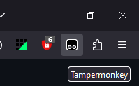
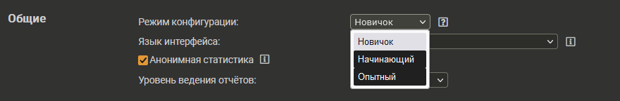
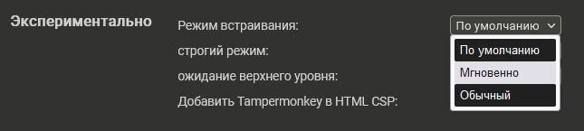

# Pixel Minimap
Данный файл содержит информацию о миникарте для сайта [PixelPlanet](https://pixelplanet.fun)  

## Содержание
[1. Установка](#installation)  
[2. Функционал](#functional)  
[3. Чек-лист](#checklist)  
[4. Контакты](#contacts)  

## <a id="installation">Установка</a>
1. Установить расширение [Tampermonkey](https://www.tampermonkey.net) для вашего браузера  
(Его можно скачать с официального сайта, а так же найти в каталоге расширений вашего браузера)  
2. Открыть [Ссылка 1](https://github.com/KeepssMe/PixelMinimap/raw/master/minimap.user.js) или [Ссылка 2](https://raw.githubusercontent.com/KeepssMe/PixelMinimap/master/minimap.user.js)
3. Нажать кнопку "Установить" (Install)
4. Открыть/перезагрузить сайт [PixelPlanet](https://pixelplanet.fun)  

__Если у вас не отображаются шаблоны, продолжаем__  

5. Нажимаем на иконку расширения  
  
6. Переходим в "Панель управления" (Dashboard)  
  
7. В окне раcширения переходим на вкладку "Настройки" (Settings)  
  
8. Меняем "Режим конфигурации" (Config mode) на "Опытный" (Advanced)  
  
9. Включаем настройки, возможно что у Вас не будет определенных настроек, игнорируем отсуствующие:  
- В разделе "Эксперементально" (Experimental) меняем "Режим встраивания" (Inject mode) на "Мгновенно" (Instant);  
  
- В разделе "Безопасность" (Security) меняем "Содержимое скрипта API" (Content Script API) на "UserScripts API Dynamyc" __(Не забудьте нажать кнопку "Сохранить" в конце этого раздела)__;  
  

__Если после этого у вас по прежнему не видно шаблонов, [свяжитесь с автором](#contacts)__

## <a id="functional">Функционал</a>
В процессе написания...

## <a id="checklist">Чек-лист</a>
В процессе составления...

## <a id="contacts">Контакты</a>
|Контакт  |Роль                 |ВК                                            |Дискорд |
|:-------:|:-------------------:|:--------------------------------------------:|:------:|
|KeepssMe |Владелец, Разработчик|[Алена Воронцова](https://vk.com/alenacrowkar)|keepssme|

Дата обновления: 22.04.2024